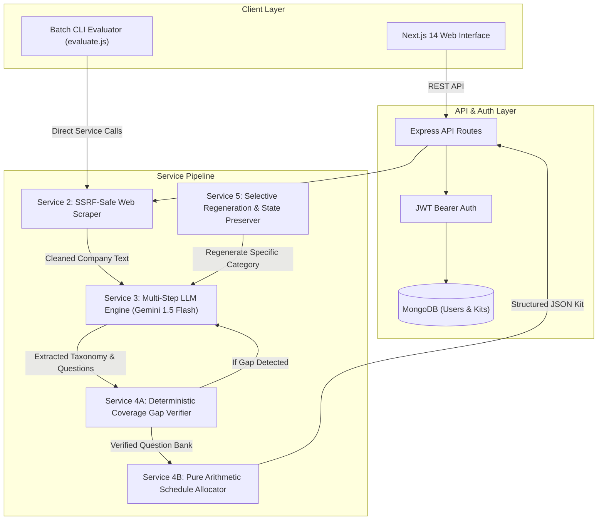

# 🚀 AI-Powered Full-Stack Interview Preparation Kit Generator

[](https://nodejs.org/)
[](https://nextjs.org/)
[](https://tailwindcss.com/)
[](https://ai.google.dev/)
[-emerald.svg)]()

An enterprise-grade, autonomous interview preparation system that ingests any job description (JD) and company URL, crawls organizational culture with SSRF safety, isolates hard technical constraints, synthesizes personalized question banks, and guarantees **100% skill coverage** through deterministic bipartite verification and a greedy daily study schedule.

---

## 🌟 Key Features

1. **🛡️ SSRF-Protected Web Crawler (`Service 2`):**
   - Deep crawls company culture, values, and engineering blogs.
   - Guarded by DNS pre-resolution against private RFC 1918 subnets, loopbacks, and cloud metadata (`169.254.169.254`).
2. **🧠 Zero-Hallucination Extraction & Generation Pipeline (`Service 3`):**
   - Powered by Google Gemini Flash with XML prompt isolation preventing prompt injection attacks.
   - Safe defaults and fallback handling for sparse/thin JDs.
   - Native `p-queue` rate limiting respecting Gemini free tier (15 RPM / 1M TPM).
3. **⚙️ Deterministic $O(R+Q)$ Coverage Verifier (`Service 4`):**
   - Algorithmic bipartite graph validation between extracted must-have skills and synthesized questions.
   - Autonomous **Second-Pass generation** if any core requirement is uncovered.
4. **📅 Pure Arithmetic Study Schedule Allocator (`Service 4`):**
   - Greedy day-by-day task allocation prioritizing hard and must-have topics earlier.
   - Guaranteed integer minute balancing without floating-point drift.
5. **🔄 Reshapeable Kit Builder & Selective State Preservation (`Service 5`):**
   - Per-category selective regeneration without losing user-edited or pinned questions.
   - Inline question editing, hand-addition, deletion, and difficulty adjustment.
6. **🃏 3D Flashcard Practice Mode:**
   - Spaced-repetition priority queue (harder cards repeat earlier).
   - Interactive flip cards with ideal solution outlines and evaluation rubrics.
   - Confetti completion celebration.
7. **⚡ Multi-Role Batch CLI & UI Evaluator (`Service 6`):**
   - `npm run evaluate -- --input <cases.json> --output <kits.json>`
   - Isolated per-case error handling with Appendix B JSON schema compliance.
8. **📄 Cheat Sheet & Markdown One-Pager Exporters:**
   - Print/PDF styling and one-click Markdown download.

---

## 🏗️ System Architecture



---

## 🛠️ Tech Stack Justification

| Layer | Technology | Decision Rationale |
|---|---|---|
| **Backend Runtime** | **Node.js 20 (ES Modules)** | Native asynchronous I/O, modern ES syntax (`import`/`export`), native `fetch` and DNS resolution, zero transpiler lag. |
| **Backend Framework** | **Express.js** | Lightweight, predictable routing, robust middleware chaining for auth and rate limiting. |
| **Validation** | **Zod** | Runtime type safety and strict schema enforcement for Appendix A & B outputs. |
| **LLM Provider** | **Google Gemini 1.5 Flash** | High reasoning throughput, 1M context window, fast token generation, structured JSON output mode. |
| **Frontend Framework** | **Next.js 14 (App Router)** | Instant client-side page transitions, modular folder structure, Tailwind CSS integration. |
| **Database** | **MongoDB & Mongoose** | Flexible document storage matching nested Appendix A interview kit structure with `userId` indexing. |
| **Testing** | **Native Node Test Runner** | Ultra-fast execution (<1.8s for 43 tests), zero third-party framework overhead. |

---

## 🚀 Quick Start Guide

### 1. Prerequisites
- **Node.js 20+** installed
- **MongoDB** running locally (`mongodb://localhost:27017`) or MongoDB Atlas URI
- **Google Gemini API Key** (Free tier from [Google AI Studio](https://aistudio.google.com/))

---

### 2. Environment Variables Setup

#### Backend Configuration (`.env` in project root)
Create a `.env` file in the root directory:
```env
# Server Configuration
PORT=4000
NODE_ENV=development

# MongoDB Connection URI
MONGODB_URI=mongodb://localhost:27017/interview_prep_db

# JWT Secret for User Authentication
JWT_SECRET=super_secret_interview_prep_jwt_key_2026

# Google Gemini API Key
GEMINI_API_KEY=your_gemini_api_key_here

# LLM Rate Limiting
GEMINI_RPM_LIMIT=15

# Security Settings
ALLOW_LOCAL_URLS=false
```

#### Frontend Configuration (`frontend/.env.local`)
Create a `.env.local` file inside the `frontend/` folder:
```env
NEXT_PUBLIC_API_BASE_URL=http://localhost:4000/api
```

---

### 3. Installation

#### Step A: Install Backend Dependencies
```bash
npm install
```

#### Step B: Install Frontend Dependencies
```bash
cd frontend
npm install
cd ..
```

---

### 4. Running the Application

#### Start the Backend API Server:
```bash
npm start
# Server will start on http://localhost:4000
```

#### Start the Next.js Frontend:
In a separate terminal:
```bash
cd frontend
npm run dev
# Frontend web interface available at http://localhost:3000
```

---

### 5. Running Automated Tests

Run the full test suite covering all 16 test files:
```bash
npm test
```
*All 43 unit and integration tests will execute in < 2 seconds.*

---

### 6. Running the Batch CLI Evaluator

Run multi-role batch evaluation with per-case error isolation:
```bash
npm run evaluate -- --input data/sample_cases.json --output dist/kits.json
```

---

## 📂 Project Structure

```
├── data/
│   └── sample_cases.json          # Batch evaluation test fixtures
├── frontend/                      # Next.js 14 App Router Frontend
│   ├── src/
│   │   ├── app/                   # App Router Pages (Landing, Dashboard, New, Kit, Practice, Bulk)
│   │   ├── components/            # Reusable UI Components (Navbar, Flashcard, Schedule, Stepper)
│   │   ├── context/               # AuthContext state provider
│   │   └── lib/                   # Axios API client & styling utils
├── src/
│   ├── cli/
│   │   └── evaluate.js            # Service 6: Batch CLI Runner
│   ├── config/
│   │   └── env.js                 # Environment variable validation
│   ├── db/
│   │   └── connection.js          # Mongoose database connector
│   ├── middleware/
│   │   └── auth.js                # JWT Bearer token authentication
│   ├── models/
│   │   ├── Kit.js                 # Appendix A Kit MongoDB Schema
│   │   └── User.js                # User Auth MongoDB Schema
│   ├── routes/
│   │   ├── auth.js                # Auth endpoints (/register, /login, /me)
│   │   └── kits.js                # Kit CRUD & category regeneration endpoints
│   ├── schemas/
│   │   ├── batchSchema.js         # Appendix B Zod Schema
│   │   └── kitSchema.js           # Appendix A Zod Schema
│   ├── services/
│   │   ├── deterministic.js       # Service 4: $O(R+Q)$ Coverage Verifier & Scheduler
│   │   ├── llm.js                 # Service 3: Gemini 1.5 Flash Pipeline
│   │   ├── regeneration.js        # Service 5: Selective State Preservation
│   │   └── scraper.js             # Service 2: SSRF-Safe Web Scraper
│   ├── utils/
│   │   └── promptSanitizer.js     # XML prompt injection sanitization
│   └── index.js                   # Express application entry point
├── tests/                         # Automated test suite (16 test suites, 43 tests)
├── SERVICES_REFERENCE.md          # Comprehensive internal developer & architecture guide
└── package.json                   # Backend ESM package definition
```

---

## 🔒 Security & Resilience

- **SSRF Prevention:** Pre-resolves domain names with `dns.promises.lookup` and checks IPs against IPv4/IPv6 private ranges and cloud metadata IPs (`169.254.169.254`) prior to initiating HTTP requests.
- **Prompt Injection Defense:** User inputs and scraped HTML are enclosed within isolated `<job_description>` and `<company_intel>` XML boundary tags with character escaping.
- **Rate Limit Resilience:** Employs a concurrency-controlled queue (`p-queue`) to pace LLM requests under free-tier thresholds with automatic exponential backoff on HTTP 429 status codes.

---

## 📜 License
MIT © Gaurav Fodekar

